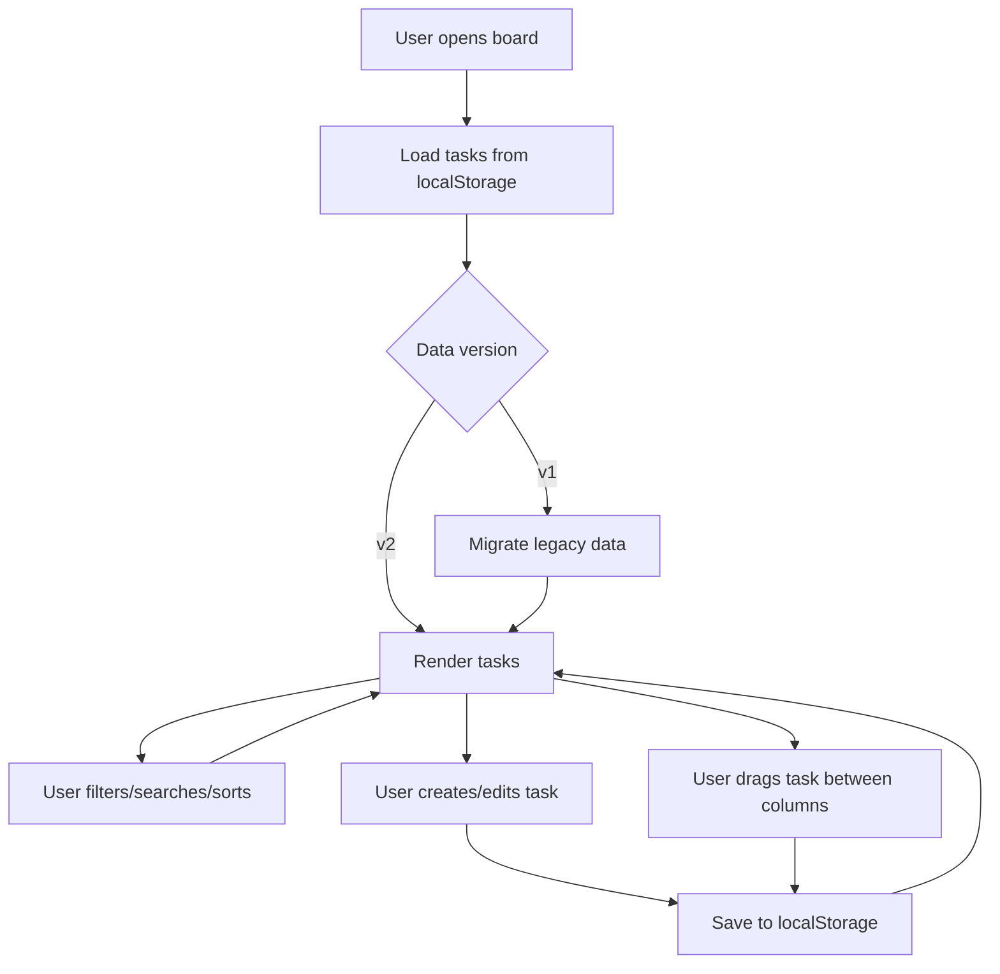
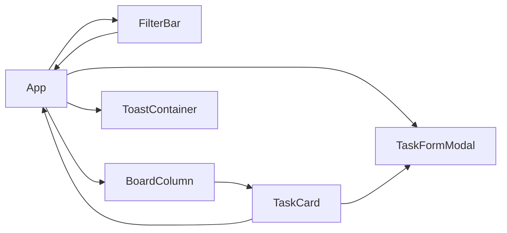

# Team Workflow Board & Design System

A React + TypeScript workflow board that combines a production-ready task management UI with a reusable custom design system. It is optimized for accessibility, responsive layouts, local persistence, and automated end-to-end test coverage.

---

## 🚀 Project Overview

This repository is built around two core systems:

1. **Workflow Board**
   - Kanban-style task columns: Backlog, In Progress, Done.
   - Search, priority filtering, column visibility toggles, and sorting.
   - Task creation, editing, deletion, and drag-and-drop status updates.
   - Local storage persistence and migration support.

2. **Design System**
   - Reusable UI primitives: buttons, inputs, selects, cards, tags, modals, and toasts.
   - Accessible form patterns with labels, error states, and focus handling.
   - Theme-aware CSS variables for light/dark mode.

---

## 📌 How to Run

### Install Dependencies
```bash
npm install
```

### Start Development Server
```bash
npm run dev
```
Open [http://localhost:5173](http://localhost:5173).

### Run Unit Tests
```bash
npm run test
```

### Run Playwright E2E Tests
```bash
npm run test:e2e
```

### Build for Production
```bash
npm run build
```

---

## 🌐 Workflow System Design

The app is structured to keep workflow logic in `src/App.tsx` and board UI in `src/components/board/` while sharing common controls through `src/components/ui/`.

### Primary Workflow Sequence



### Component Interaction Diagram



---

## 🧩 Folder Structure

- `src/App.tsx` - Main app container and task workflow logic.
- `src/components/board/` - Workflow board UI:
  - `BoardColumn.tsx` - Column container with drop target behavior.
  - `FilterBar.tsx` - Search, sort, priority, and visibility controls.
  - `TaskCard.tsx` - Draggable task preview card.
  - `TaskFormModal.tsx` - Create/edit task modal.
- `src/components/ui/` - Design system primitives:
  - `Button.tsx`, `Card.tsx`, `Modal.tsx`, `Select.tsx`, `Tag.tsx`, `TextArea.tsx`, `TextInput.tsx`, `Toast.tsx`.
- `src/hooks/` - Reusable hooks:
  - `useLocalStorage.ts`, `useQueryParams.ts`, `useToast.tsx`.
- `src/types/index.ts` - Shared task, priority, and sort type definitions.
- `src/utils/` - Utility helpers:
  - `migration.ts`, `time.ts`.
- `tests/` - Test infrastructure:
  - `setup.ts`, `workflow.test.tsx`, `e2e.spec.ts`.

---

## ✨ Workflow Features

- **Task filtering** by text and priority.
- **Column visibility** toggles for Backlog, In Progress, and Done.
- **Sort options** for creation date, update date, and priority.
- **Task cards** show title, description, tags, assignee initials, and time updated.
- **Accessible interactions** for keyboard users and screen readers.
- **Persistent state** via local storage and query parameters.
- **Light + Dark theme** toggle.

---

## 🧠 Design System Principles

- **Consistency**: All controls use shared spacing, typography, and border styles.
- **Accessibility**: Labels, focus rings, keyboard interactions, and ARIA attributes are respected.
- **Reusability**: UI primitives are generic and composable.
- **Responsiveness**: Layout adapts from desktop board view to stacked mobile card lists.

---

## 🧪 Testing Strategy

- **Unit/Integration**: `npm run test` executes Vitest tests for task creation, filtering, migration, and component behavior.
- **E2E**: `npm run test:e2e` runs Playwright scenarios against the app using `http://localhost:5173`.
- **Playwright coverage** includes task creation, search/filtering, and board visibility toggles.

---

## 🛠️ Improvements & Roadmap

Possible next steps:
- Add drag-and-drop support on touch devices using pointer events.
- Add task detail view with attachments and comments.
- Replace local storage with a backend API or IndexedDB storage layer.
- Add user authentication and team-based boards.
- Add a kanban summary dashboard with cycle time metrics.


https://app.eraser.io/workspace/mRhMwuqyRLndyudPCzWR?origin=share&diagram=2Z-PEf9QpxB2WmhDvzcO0
